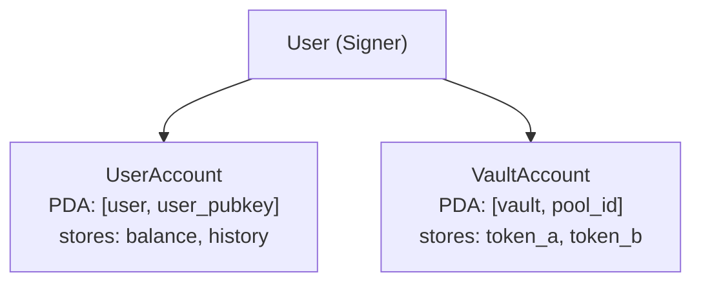
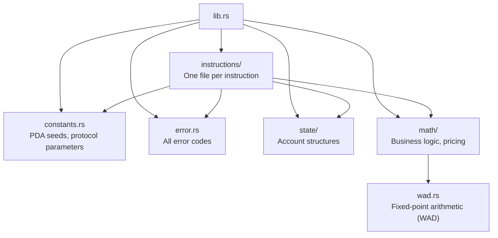

# Architecture

> System design, account model, and module dependencies.
> Keep this document updated as the program evolves.

## System Overview

<!-- Describe the high-level system: what the protocol does, who interacts with it. -->

## Account Model

<!-- Replace this example with your protocol's account model -->

<!-- Edit the diagram above to match your protocol's accounts -->

## PDA Seed Design

<!-- Document ALL PDAs here. This is critical for consistency.

| PDA Name | Seeds | Bump Stored? | Purpose |
|----------|-------|-------------|---------|
| Example  | ["example", key] | Yes (in ExampleAccount.bump) | Stores example data |
-->

## Module Dependencies

## Data Flow

<!-- Describe how data flows through the system.
Example: User → Frontend → SDK → On-chain Program → State Update
-->

## Security Considerations

<!-- Document security-critical design decisions and their rationale. -->
